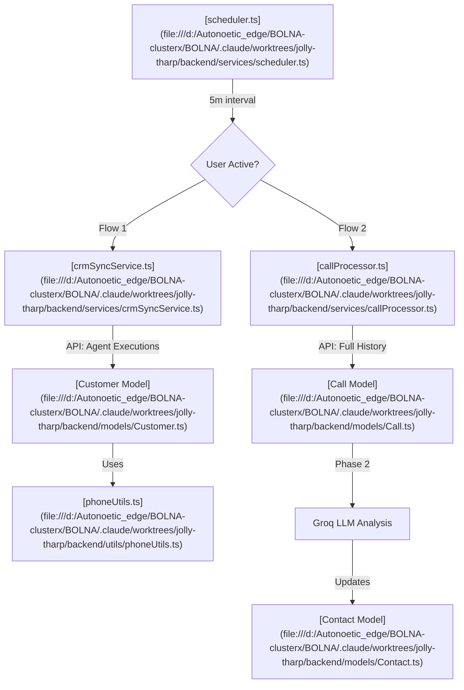

# Backend Sync & LLM Intelligence Architecture

This document outlines the dual-track synchronization system that powers lead generation and call intelligence from the Bolna API.

## 1. Sync Architecture Overview

The system runs two concurrent synchronization pipelines every 5 minutes:

### Flow 1: Direct CRM Sync ([crmSyncService.ts](file:///d:/Autonoetic_edge/BOLNA-clusterx/BOLNA/.claude/worktrees/jolly-tharp/backend/services/crmSyncService.ts))
- **Purpose**: Fast population of the "Customers" section.
- **Data Source**: Fetches recent `executions` per agent via [bolnaService.ts](file:///d:/Autonoetic_edge/BOLNA-clusterx/BOLNA/.claude/worktrees/jolly-tharp/backend/services/bolnaService.ts).
- **Mapping**: Converts Bolna `extracted_data` directly into [Customer](file:///d:/Autonoetic_edge/BOLNA-clusterx/BOLNA/.claude/worktrees/jolly-tharp/backend/models/Customer.ts) records.
- **Normalization**: Uses [phoneUtils.ts](file:///d:/Autonoetic_edge/BOLNA-clusterx/BOLNA/.claude/worktrees/jolly-tharp/backend/utils/phoneUtils.ts) to ensure `+91123...` matches `123...` in the CRM.

### Flow 2: Deep Interaction Pipeline ([callProcessor.ts](file:///d:/Autonoetic_edge/BOLNA-clusterx/BOLNA/.claude/worktrees/jolly-tharp/backend/services/callProcessor.ts))
- **Purpose**: Detailed call history, transcripts, and LLM-driven insights.
- **Phase 1 (Sync)**: Rapidly pulls all calls into the [Call](file:///d:/Autonoetic_edge/BOLNA-clusterx/BOLNA/.claude/worktrees/jolly-tharp/backend/models/Call.ts) collection using [callPoller.ts](file:///d:/Autonoetic_edge/BOLNA-clusterx/BOLNA/.claude/worktrees/jolly-tharp/backend/services/callPoller.ts).
- **Phase 2 (Analyze)**: Background processing of transcripts using Groq LLM ([llmService.ts](file:///d:/Autonoetic_edge/BOLNA-clusterx/BOLNA/.claude/worktrees/jolly-tharp/backend/services/llmService.ts)).

## 2. LLM / Groq Optimization

To ensure cost-efficiency and performance, the LLM pipeline includes the following guardrails:

- **Batch Limit**: Processes a maximum of **10 calls** per 5-minute run.
- **Transcript Filter**: Calls with <15 characters skip the LLM.
- **Process Once Guarantee**: Every call is marked as `processed: true` after one attempt (success or failure) to prevent infinite retry loops.
- **Rate Limit Resilience**: Exponential backoff (35s+) for Groq 429 errors.

## 3. Data Intelligence Mapping

| Feature | Source (Bolna) | CRM Destination | Business Value |
| :------- | :-------------- | :--------------- | :-------------- |
| **Lead Status** | Agent Intent | `customer.status` | Auto-sorts "Booked" leads. |
| **Contact Tag** | LLM Result | `contact.tag` | Flags "Purchased",`follow_up`, "Interested". |
| **Summary** | LLM Analysis | `pastConversations`| 1-sentence recap of call context. |
| **Normalization**| [phoneUtils](file:///d:/Autonoetic_edge/BOLNA-clusterx/BOLNA/.claude/worktrees/jolly-tharp/backend/utils/phoneUtils.ts) | `phoneNumber` | Prevents duplicate leads across formats. |

## 4. Conflict Resolution & Indexing

- **Unique Call ID**: The `call_id` index in the [Call Model](file:///d:/Autonoetic_edge/BOLNA-clusterx/BOLNA/.claude/worktrees/jolly-tharp/backend/models/Call.ts) is globally unique. Attempts to re-sync the same call ID will result in a `$set` update rather than a duplicate error.
- **Phone Deduplication**: Lookup in CRM uses a `$or` match on both the raw number and the normalized number.

---
> [!IMPORTANT]
> **Extending the Pipeline**: New intelligence fields (like "Budget" or "Special Requests") should be added to the LLM prompt in [llmService.ts](file:///d:/Autonoetic_edge/BOLNA-clusterx/BOLNA/.claude/worktrees/jolly-tharp/backend/services/llmService.ts) and then mapped in [callProcessor.ts](file:///d:/Autonoetic_edge/BOLNA-clusterx/BOLNA/.claude/worktrees/jolly-tharp/backend/services/callProcessor.ts).
