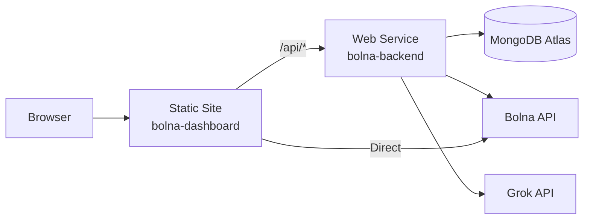

# Deploying Bolna Dashboard on Render

Your project has **two parts** that need separate Render services:

| Part | Type | Directory | What it does |
|------|------|-----------|-------------|
| **Backend** | Web Service | `backend/` | Express API on port 5000 (call processor, auto-polling, MongoDB) |
| **Frontend** | Static Site | `client/` | Vite + React dashboard |

---

## Prerequisites

- A [Render account](https://render.com) (free tier works)
- Your repo pushed to **GitHub** (Render deploys from Git)
- Your MongoDB Atlas cluster IP whitelist set to `0.0.0.0/0` (allow from anywhere) so Render can connect

---

## Step 1: Deploy the Backend (Web Service)

1. **Render Dashboard → New → Web Service**
2. Connect your GitHub repo
3. Configure:

| Setting | Value |
|---------|-------|
| **Name** | `bolna-backend` |
| **Root Directory** | _(leave blank — it's a monorepo)_ |
| **Runtime** | `Node` |
| **Build Command** | `npm install` |
| **Start Command** | `npx tsx backend/server.ts` |
| **Instance Type** | Free (or Starter) |

4. **Environment Variables** — click **Add Environment Variable** and add:

| Key | Value |
|-----|-------|
| `MONGODB_URI` | `mongodb+srv://...` _(your Atlas connection string)_ |
| `GROK_API_KEY` | `gsk_...` _(your Grok API key)_ |
| `BOLNA_API_KEY` | `bn-...` _(your Bolna API key)_ |
| `NODE_ENV` | `production` |

> [!IMPORTANT]
> Do **NOT** commit your [.env](file:///d:/Autonoetic_edge/BOLNA-clusterx/BOLNA/.env) file to GitHub. Render's environment variables replace your local [.env](file:///d:/Autonoetic_edge/BOLNA-clusterx/BOLNA/.env) — they are injected at runtime.

5. Click **Create Web Service**

6. Once deployed, note your backend URL — it will be something like:
   `https://bolna-backend.onrender.com`

---

## Step 2: Deploy the Frontend (Static Site)

1. **Render Dashboard → New → Static Site**
2. Connect the same GitHub repo
3. Configure:

| Setting | Value |
|---------|-------|
| **Name** | `bolna-dashboard` |
| **Root Directory** | `client` |
| **Build Command** | `npm install && npm run build` |
| **Publish Directory** | `client/dist` |

4. **Environment Variables** — add:

| Key | Value |
|-----|-------|
| `VITE_BOLNA_API_KEY` | `bn-...` _(same Bolna API key)_ |
| `VITE_API_BASE_URL` | `https://bolna-backend.onrender.com` _(your backend URL from Step 1)_ |

> [!TIP]
> Vite only exposes env vars prefixed with `VITE_` to the frontend build. The `BOLNA_API_KEY` (without prefix) is also needed because [bolnaApi.ts](file:///d:/Autonoetic_edge/BOLNA-clusterx/BOLNA/client/src/lib/bolnaApi.ts) checks both `import.meta.env.BOLNA_API_KEY` and `import.meta.env.VITE_BOLNA_API_KEY`.

5. **Add Rewrite Rule** for SPA routing:
   - Go to **Redirects/Rewrites** tab
   - Add: Source: `/*` → Destination: [/index.html](file:///d:/Autonoetic_edge/BOLNA-clusterx/BOLNA/client/index.html) → Action: **Rewrite**
   - This ensures React Router works on page refresh

6. Click **Create Static Site**

---

## Step 3: Fix the Bolna API URL Issue

> [!CAUTION]
> Currently `api.bolna.ai` is not resolving (DNS failure). Before deploying, you need to confirm the correct Bolna API URL and update it in:
> - [backend/services/callPoller.ts](file:///d:/Autonoetic_edge/BOLNA-clusterx/BOLNA/backend/services/callPoller.ts) (line 7)
> - [client/src/lib/bolnaApi.ts](file:///d:/Autonoetic_edge/BOLNA-clusterx/BOLNA/client/src/lib/bolnaApi.ts) (line 3)
> - [client/src/api/bolnaCampaigns.ts](file:///d:/Autonoetic_edge/BOLNA-clusterx/BOLNA/client/src/api/bolnaCampaigns.ts) (line 255)

If the URL works from Render's servers but not locally, it may be a local DNS/firewall issue — test after deploying.

---

## Step 4: Verify

1. **Backend health check** — visit `https://bolna-backend.onrender.com/api/processed-calls` in your browser. You should get a JSON response (empty array `[]` is fine).

2. **Frontend** — visit your static site URL (e.g. `https://bolna-dashboard.onrender.com`). The dashboard should load and connect to the backend.

3. **Check Render logs** — click on each service → **Logs** tab to see startup output and auto-polling logs.

---

## Architecture on Render



---

## Common Issues

| Issue | Fix |
|-------|-----|
| Backend sleeps on free tier | Render free tier spins down after 15 min inactivity. Auto-polling won't run when sleeping. Upgrade to Starter ($7/mo) for always-on. |
| Frontend API calls fail with CORS | Make sure your backend has `cors()` middleware enabled (it does — [server.ts](file:///d:/Autonoetic_edge/BOLNA-clusterx/BOLNA/backend/server.ts) line 23). |
| Frontend shows blank page | Check that the Rewrite rule `/* → /index.html` is configured. |
| `ENOTFOUND api.bolna.ai` | The Bolna API domain isn't resolving — confirm the correct URL with Bolna. |
| Build fails on `client` | The root [package.json](file:///d:/Autonoetic_edge/BOLNA-clusterx/BOLNA/package.json) has all deps. Set root directory to `client` and ensure [client/package.json](file:///d:/Autonoetic_edge/BOLNA-clusterx/BOLNA/client/package.json) has all the required dependencies. |

---

## Optional: Use a `render.yaml` Blueprint

Instead of manual setup, you can create a `render.yaml` in your repo root for Infrastructure-as-Code:

```yaml
services:
  - type: web
    name: bolna-backend
    runtime: node
    buildCommand: npm install
    startCommand: npx tsx backend/server.ts
    envVars:
      - key: MONGODB_URI
        sync: false
      - key: GROK_API_KEY
        sync: false
      - key: BOLNA_API_KEY
        sync: false
      - key: NODE_ENV
        value: production

  - type: web
    name: bolna-dashboard
    runtime: static
    rootDir: client
    buildCommand: npm install && npm run build
    staticPublishPath: dist
    routes:
      - type: rewrite
        source: /*
        destination: /index.html
    envVars:
      - key: VITE_BOLNA_API_KEY
        sync: false
      - key: VITE_API_BASE_URL
        sync: false
```

Then go to **Render Dashboard → Blueprints → New Blueprint Instance** and point to your repo.
